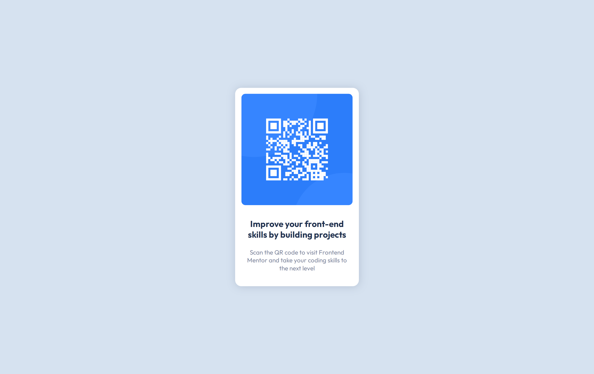

# Frontend Mentor - QR code component solution

This is a solution to the [QR code component challenge on Frontend Mentor](https://www.frontendmentor.io/challenges/qr-code-component-iux_sIO_H). Frontend Mentor challenges help you improve your coding skills by building realistic projects.

## Table of contents

- [Overview](#overview)
  - [Screenshot](#screenshot)
  - [Links](#links)
- [My process](#my-process)
  - [Built with](#built-with)
  - [What I learned](#what-i-learned)
- [Author](#author)

**Note: Delete this note and update the table of contents based on what sections you keep.**

## Overview

### Screenshot




### Links

- Solution URL: [Add solution URL here](https://www.frontendmentor.io/solutions/qrcode-challenge-BJZ14swQq)
- Live Site URL: [Add live site URL here](https://ibrahemnaser.github.io/fRontEnDMentor_QRCode/)

## My process

### Built with

- HTML
- CSS custom properties
- Mobile-first workflow

### What I learned

This challenge was a good chance for me to practice more on HTML & CSS techniques in my starting journey in learning frontend.
First, centering the card exactly in the middle of the screen was a funny thing to learn and here is my style code:
```css
.card {
  position: absolute;
  top: 50%;
  left: 50%;
  transform: translate(-50%, -50%)
}
```
Secondly, box shadow property is a very beautiful thing to add some depth for the design:
```css
.card {
  box-shadow: 1px 1px 20px 0px hsl(220deg 15% 55% / 34%);
}
```

At the end I hope that challenge encourage me to move further in my journey ^_^.

## Author

- Website - [Ibrahem Naser](https://ibrahemnaser.github.io/Portfolio/index.html)
- Frontend Mentor - [@ibrahemnaser](https://www.frontendmentor.io/profile/ibrahemnaser)
